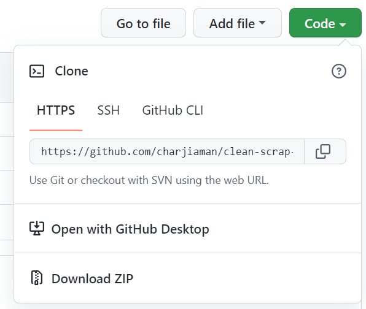

# Download source code repository

- Click on Download ZIP link under **Code** button as shown in screenshot below.

# Clean and reorganize any ScrapData.csv to form new csv file for scrap reports

- Create a folder in C drive "**C:\scrap_report**".
- Please download "ScrapData.csv" and save in the same folder.
- Download and install Visual Studio Code from the portal manager.
- Download and install Python from the portal manager.
- Open Visual Studio Code, go to View, open terminal.
- Install panda libarary by typing "pip install pandas" in the terminal, hit enter.
- Run the code using F5 function key and the new scrap report "CleanScrap.csv" will be generated in the same folder where the original "ScrapData.csv" is.
- Make sure to delete the original "ScrapData.csv" and the generated "CleanScrap.csv" if you want to download another "ScrapData.csv".